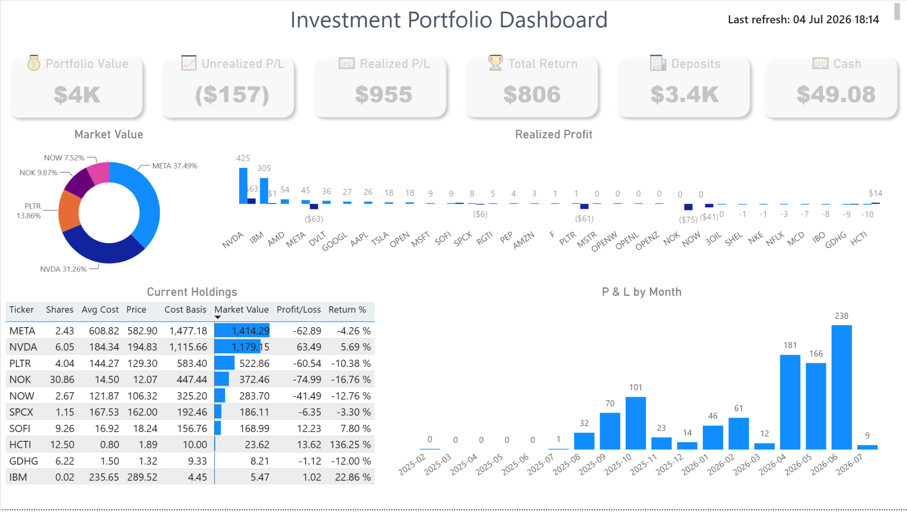

# 📈 Investment Portfolio Analytics
## End-to-End Microsoft Fabric & Power BI Solution

An end-to-end investment portfolio analytics solution built with **Microsoft Fabric**, **Python**, **Delta Lake**, and **Power BI**.

The project automates the processing of Trading212 investment data, enriches it with live market prices from Yahoo Finance, stores the transformed data inside a Microsoft Fabric Lakehouse, and visualizes portfolio performance through an interactive Power BI dashboard.

---

**Dashboard Preview**



**Pipeline Architecture**

Images/Pipeline.JPG

---

# Project Overview

This solution automates the complete investment reporting process for a personal investment portfolio.

Instead of manually calculating portfolio performance, the project performs an automated ETL workflow that:

- Imports Trading212 portfolio exports
- Cleans and transforms investment data
- Creates Delta Lake tables inside Microsoft Fabric Lakehouse
- Downloads live market prices from Yahoo Finance
- Calculates current portfolio positions
- Builds a semantic model
- Visualizes portfolio KPIs using Power BI

The result is a fully automated reporting solution that provides up-to-date investment insights with minimal manual intervention.

---

# Project Objectives

The objective of this project is to demonstrate an end-to-end analytics solution using Microsoft Fabric.

The project covers the complete data lifecycle:

- Data ingestion
- Data transformation
- Lakehouse storage
- Market data enrichment
- Automated refresh
- Semantic modeling
- Interactive Power BI reporting

The solution was developed using real Trading212 investment data to automate portfolio analysis and reporting.

---

# Solution Architecture

```
                 Trading212 Portfolio Export (.xlsx)
                               │
                               ▼
                    OneLake Files (Microsoft Fabric)
                               │
                               ▼
                  Investment_ETL_v2 Notebook
      ───────────────────────────────────────────────
      • Reads Trading212 Excel workbook
      • Cleans and standardizes data
      • Creates Delta Lake tables
      • Calculates portfolio positions
      • Calculates cost basis
      • Calculates market value
      • Calculates unrealized P/L
      ───────────────────────────────────────────────
                               │
                               ▼
                  Fabric Lakehouse (Delta Tables)

        portfolio_powerbi
        all_trades
        deposits
        dividends
        monthlysummary
        tickersummary
        portfolio_positions
                               │
                               ▼
              Investment_Data_Refresh Notebook
      ───────────────────────────────────────────────
      • Downloads latest stock prices
      • Retrieves market data from Yahoo Finance
      • Updates stock_prices table
      ───────────────────────────────────────────────
                               │
                               ▼

                      stock_prices (Delta Table)
                               │
                               ▼
                        Semantic Model
                               │
                               ▼
                 Power BI Investment Dashboard
```

---

# ETL Workflow

## Notebook 1 — Investment_ETL_v2

Responsible for preparing and transforming the portfolio data.

### Main tasks

- Import Trading212 Excel export
- Clean and normalize data
- Convert worksheets into Delta tables
- Calculate current holdings
- Calculate remaining cost basis
- Calculate market value
- Calculate unrealized profit/loss

### Output tables

- portfolio_powerbi
- portfolio_positions
- deposits
- dividends
- monthlysummary
- tickersummary
- all_trades

---

## Notebook 2 — Investment_Data_Refresh

Responsible for refreshing market data.

### Main tasks

- Connect to Yahoo Finance
- Download latest stock prices
- Update stock_prices table
- Store latest market data timestamp

---

# Data Flow

```
Trading212 Excel Export
        │
        ▼
Upload to OneLake
        │
        ▼
Investment_ETL_v2 Notebook
        │
        ▼
Lakehouse Delta Tables
        │
        ▼
Investment_Data_Refresh Notebook
        │
        ▼
stock_prices
        │
        ▼
Semantic Model
        │
        ▼
Power BI Dashboard
```

---

# Dashboard Features

The dashboard provides:

- Portfolio Value
- Unrealized Profit/Loss
- Realized Profit/Loss
- Total Return
- Deposits
- Available Cash Balance
- Portfolio Allocation
- Current Holdings
- Monthly Profit/Loss
- Latest Market Data Timestamp
- Interactive filtering by Ticker, Year, and Quarter

---

# Technologies Used

- Microsoft Fabric
- OneLake
- Lakehouse
- Delta Lake
- Apache Spark
- Python
- Pandas
- Yahoo Finance (yfinance)
- Power BI
- DAX

---

# Key Skills Demonstrated

This project demonstrates practical experience with:

- Microsoft Fabric Lakehouse
- Apache Spark
- Python ETL Development
- Pandas Data Transformation
- Delta Table Management
- Financial Data Modeling
- Microsoft Fabric Pipelines
- Semantic Model Design
- Power BI Dashboard Development
- DAX Measures
- Investment Analytics

---

# Repository Structure

```
investment-portfolio-fabric-powerbi/

│
├── README.md
│
├── Images/
│   ├── dashboard.png
│   ├── architecture.png
│   ├── lakehouse.png
│   └── semantic_model.png
│
├── Notebooks/
│   ├── Investment_ETL_v2.py
│   └── Investment_Data_Refresh.py
│
├── PowerBI/
│   └── Investment Portfolio Dashboard.pbix
│
├── Docs/
│   ├── architecture.md
│   ├── setup.md
│   ├── data-model.md
│   └── pipeline.md
│
└── LICENSE
```

---

# Future Improvements

### Version 2.0

- Portfolio value history
- Daily portfolio snapshots
- Benchmark comparison (S&P 500 / Nasdaq)
- Sector allocation
- Dividend growth analysis
- Portfolio volatility
- Sharpe Ratio
- Best and worst performing investments
- Holding period analysis

---

# Author

**Altin Salihi**

Data Analyst | Microsoft Fabric | Power BI | Python | SQL

---

*This project was developed as a personal portfolio project to demonstrate end-to-end data engineering, analytics, and business intelligence skills using Microsoft Fabric and Power BI.*
